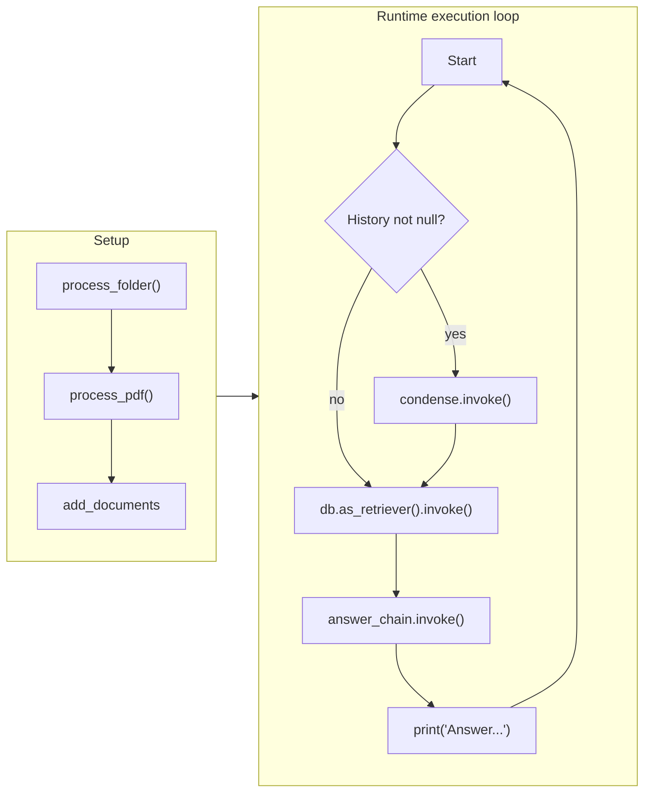

# Local-Rag-Agent

I'm studying Generative AI technologies and this repo serves as my practical exercise workspace.

This is the current architecture

```mermaid
flowchart LR
    subgraph di[Setup]
        PFD["process_folder()"] --> PDF["process_pdf()"] --> VDB[add_documents]
    end
    di --> rt
    subgraph rt[Runtime execution loop]
        st[Start] --> chk{History not null?}
        chk -->|yes| condense["condense.invoke()"]
        chk -->|no| retrieve["db.as_retriever().invoke()"]
        condense --> retrieve
        retrieve --> ans["answer_chain.invoke()"]
        ans --> prin["print('Answer...')"]
        prin --> st
    end
```